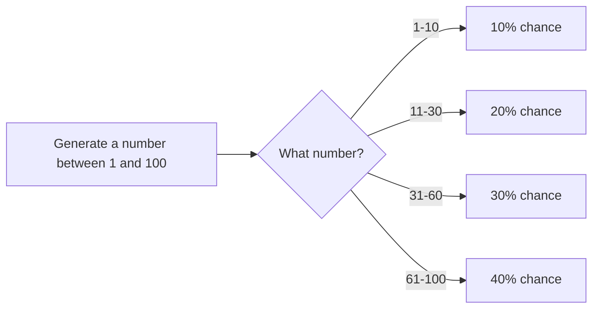
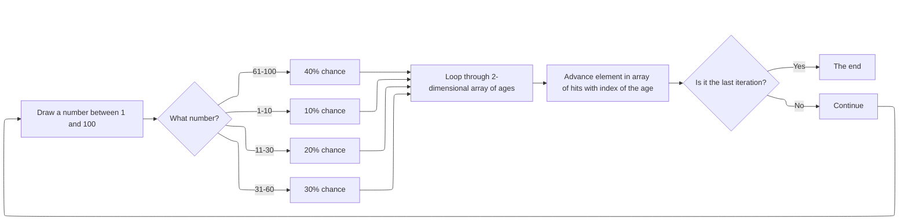

# 1.3 Probability Distributions

### Task 1

- Create a list of possible ages
    - Add a value to that age or age that corresponds to the percentage
        share of people of that age
- Create a list to hold the amount of generated ages
    - Array with elements as many as maximum age
- Generate a random number between 1 and 100
    - Match the number to age that corresponds to the chance of generating
        that number
    - Advance counter on the array with amount of generated ages in the index of that age
- Repeat for 1000 times to get better randomness for the distribution

For example:
- A two-dimensional array comprised of number determining the percentage of demographics
    and the age of the demographics
- Array with elements as many as the maximum age for tracking the amount of people of that age
- Loop through the array until the randomly generated number is at least as large as the start value
    of the range for that age
- Advance the value in the index corresponding that age in the array, e.g. if the age is 20 advance value in index 20
- Repeat 1000 times for better distribution
- Loop through the resulting array with the amount of people of specific age

#### Random number mapping to a percentage chance

#### Flowchart of program flow

### Task 3

Why can't a Singleton object be created from outside the Singleton class using the new operation?
- New would create a new instance of Singleton class and there can only be one static singleton
    therefore it must not be possible to instantiate the singleton object and it must be handled
    from within the singleton class

### Task 4

- Probability distributions
    - Binomial distribution and normal distribution
        - These could be used in our transportation simulation to decide
            which customers have seasonal tickets and who needs to buy a singletrip ticket and
            whether the passenger is heading to north or south (to city center or to suburbs)
        - If there will be more stations in the simulation this would be a perfect place for the use
            of normal distribution
- Exponential distribution
    - Often used to model customer arrivals so would be a good choice for generating arrival events

