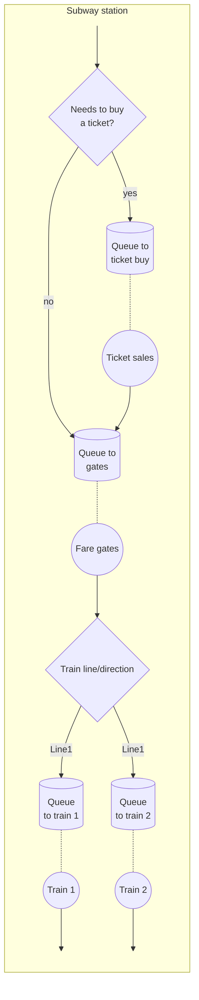
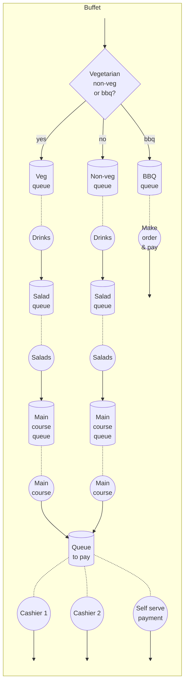

# 1.4 Performance Variables


### Task 1


#### Example case: transportation, train-/subwaystation

We can measure arrival count, active time in service point and total simulation time to track
    how much of the time is used in the actual train and how much of it queueing and how ticket systems
    and prebought monthly passes affect the transit times and efficiencies. I am assuming client
    service count to be 100%.
We can use this data to derive the utilization of the trains, ticket sales, platforms and ticket
    checking gates and how these are affected by changing the parameters, e.g. percentage of pre-bought
    monthly passes versus single tickets bough at the station. And the passenger capacities of the
    trains and how much that can affect the end capacity of the whole system.
Also queue lengths and response times can be simulated and observed estimating the effect of more sales
    points for tickets, effect of pre-bought monthly passes and larger train capacities or more
    frequent trains.


### Task 2


- Service point
    - Service throughput
    - Average service time
    - Cumulative waiting time
    - Average queue length
    - Arrival count
    - Completed count
    - Total simulation time
    - Average response time
- Customer
    - Response time, individual
    - Active time in service point, individual


### Task 3


#### Subway




#### School lunch buffet




### Task 4


```
events[] = createArrivals();    // create B1 & B2
servicepoints[] = createServicepoints();

while(events)
    event = events[].poll();    // A phase
    clock.set(event.getTime());

    switch(event)
        case IN:    // arrivals => create C1 event
            servicepoint[0].add(new Customer());
        case SP0:   // we route to 2 different paths for 2 different customer types
                    // C1 event ready
            if (customer.type == 1)     // B3 ready => create C2 events
                servicepoint[1].add(servicepoint[0].poll());
            if (customer.type == 2)     // B3 ready => create C3 events
                servicepoint[2].add(servicepoint[0].poll());
        case SP1:   // type 1 served => C2 event ready => create B4 & C4
            servicepoint[3].add(servicepoint[1].poll());
        case SP2:   // type 2 served => C3 event ready => create B5 & C4
            servicepoint[3].add(servicepoint[2].poll());
        case SP3:   // both come to cashier for example => C4 ready => create B6
            createReport(servicepoint[3].poll());
```

| Event type | Type    | Explanation |
|------------|---------|-------------|
| B1 & B2    | Arrival | Customer type 1 or 2 arrive |
| B3         | Finish  | Router ready |
| B4 & B5    | Finish  | SP 1 or 2 ready |
| B6         | Finish  | SP 3 ready, common for both customer types |
| C1         | Start   | Router starts working |
| C2 & C3    | Start   | SP1 or SP2 start working |
| C4         | Start   | SP3 starts working, common for both customer types |


### Task 5

A phase
    - Clock is used to advance time to the time of the next event

B phase
    - Clock is read to get current time and compared to the time of the next event
    - Engine pulls the next event (suoritaBtapahtumat)
    - Engine (suoritatapahtuma) reads B events matching current time and acts according to event type;
        service finished or routing finished
        Creates B1 & 2 events when B4 & B5 events finish
    - Customer report is triggered when last B event created for finishing the simulation

C phase
    - Engine checks whether ServicePoint is free and there is an event queued (yritaCtapahtumat)
    - ServicePoint starts service and generates B event, timed for when C activity is done (aloitapalvelu)
    - Clock used to set time for B event


