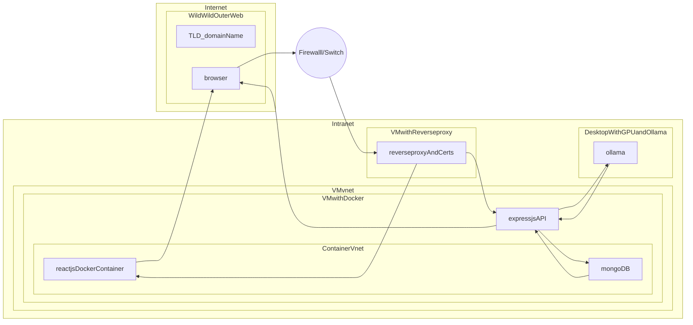

# Network setup

- reverse proxy and cert management for SSL https 443 connections
- vm with dockers for reactjs and expressjs
- dekstop with GPU and LLM capabilities, inside internal network NOT exposed to internet aka behind a strict firewall
- browser and TLD/DNS services in the wild wild web where blackhats hunt for prey

